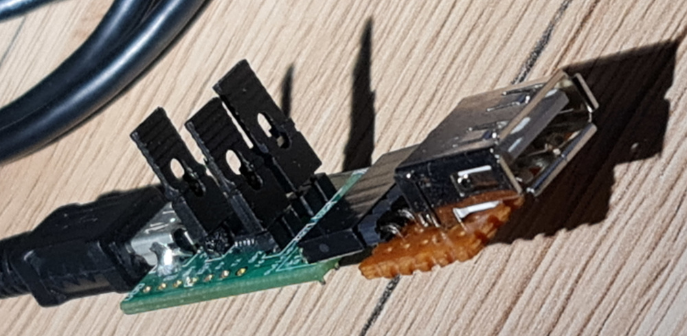

# EEPROM programmer
Two bytes addressable EEPROM programmer (e.g. AT24CM02, 25LC512, etc.)

Try running `python eep_programmer.py -h` for parameters

This little script I am using to transfer data files to my USB EEPROMS. 
The input may come from `<stdin>` as well as from any file.
When using `<stdin>`, the format is always [IntelHEX](https://en.wikipedia.org/wiki/Intel_HEX).
The input file can be either [IntelHEX](https://en.wikipedia.org/wiki/Intel_HEX) or plain binary format. The input parsing is done by [intelhex](https://pypi.org/project/intelhex/) module.

The USB EEPROM is just a hack of reusing the USB connector to have an easy to use connector for I²C devices.
I have came out with a connection, that is very compatible to USB. (This means your PC will not explode if you plug the I²C device accidentally to a regular USB port)

The simplest way to interface the I²C bus to PC is via the [MCP2221A](https://www.microchip.com/MCP2221) USB to I²C bridge. The MCP2221A driver uses the [hidapi](https://pypi.org/project/hidapi/) python module.

For this mockup I was using an [ADM00559](https://www.microchip.com/ADM00559) breakout board and connected a USBA connector soldered to a prototyping board.

You can easily make your own USBEE programmer based on the following schematics, also posted in the repository as [KiCAD](https://kicad.org/) and PDF formats:

The setup used for SW development.
